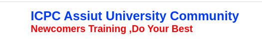

# Resources for Competitive Programming Basics.

---

Here I will try to list resources for starting competitive programming.

### Programming Language Resources

---

##### C++

[c programming Bangla Tutorials (সবার জন্য সি প্রোগ্রামিং) - YouTube](https://www.youtube.com/playlist?list=PLgH5QX0i9K3pCMBZcul1fta6UivHDbXvz)

[Pattern printing in C programming (Bangla) - YouTube](https://www.youtube.com/playlist?list=PLgH5QX0i9K3oTxQhx2kejYmQn6qtRULCD)

[C++ Bangla Tutorials - YouTube](https://www.youtube.com/playlist?list=PLgH5QX0i9K3q0ZKeXtF--CZ0PdH1sSbYL)

##### C++ STL(Standard Template Library)

###### Bangla

This playlist is from Shahriar Sadiq vai (CSE-18)

[STL Full Series (Bangla) | C++ - YouTube](https://www.youtube.com/playlist?list=PL0G2Ga9ALv6lgn-tZy5BxFzdr1AZ2E74l)

This playlist is from CPS Academy

[Standard Template Library of C++ ( STL ) [ Bangla ] - YouTube](https://www.youtube.com/playlist?list=PLoa_roVVsxA0D1Kv_T7rbGHtSdYIUo4f5) 

### Programming Problems for starters

This is a list of very easy problems in codeforces. 
